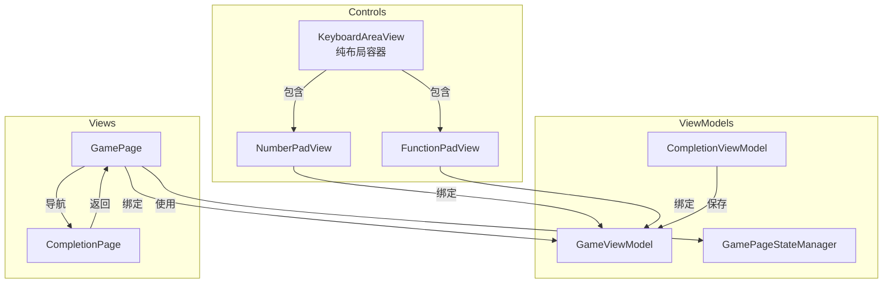

# 游戏页面状态管理与键盘组件重构优化计划

> **面向 AI 代理的工作者：** 必需子技能：使用 superpowers:subagent-driven-development（推荐）或 superpowers:executing-plans 逐任务实现此计划。步骤使用复选框（`- [ ]`）语法来跟踪进度。

**目标：** 优化游戏页面状态管理机制，重构键盘组件职责分离，提升代码可维护性和可测试性

**架构：** 
1. 引入页面状态管理器统一处理各种导航场景
2. 重构 KeyboardAreaView 为纯布局容器，键盘子控件直接绑定到 ViewModel
3. 修正完成页面导航流程，确保参数正确传递

**技术栈：** .NET MAUI, MVVM 模式, C# 10+

---

## 文件结构

### 新增文件
- `SudoKu/ViewModels/GamePageStateManager.cs` - 游戏页面状态管理器，统一处理各种导航场景

### 修改文件
- `SudoKu/Views/GamePage.xaml.cs` - 使用状态管理器
- `SudoKu/Controls/KeyboardAreaView.cs` - 简化为纯布局容器，移除命令绑定职责
- `SudoKu/ViewModels/GameViewModel.cs` - 添加状态持久化方法，改进初始化逻辑
- `SudoKu/ViewModels/CompletionViewModel.cs` - 保存游戏参数，支持"再玩一次"功能
- `SudoKu/Views/GamePage.xaml` - 添加键盘控件的 XAML 数据绑定

---

## 任务分解

### 任务 1：创建游戏页面状态管理器

**文件：**
- 创建：`SudoKu/ViewModels/GamePageStateManager.cs`

**职责：** 统一管理游戏页面的各种导航场景和状态保持

- [ ] **步骤 1：编写状态管理器基础结构**

```csharp
namespace SudoKu.ViewModels;

/// <summary>
/// 游戏页面状态管理器 - 统一处理各种导航场景
/// </summary>
public class GamePageStateManager
{
    private readonly GameViewModel _viewModel;
    private bool _isFirstNavigation = true;
    private bool _hasActiveGame = false;
    private GameType? _lastGameType;
    private Difficulty? _lastDifficulty;

    public GamePageStateManager(GameViewModel viewModel)
    {
        _viewModel = viewModel ?? throw new ArgumentNullException(nameof(viewModel));
    }

    /// <summary>
    /// 处理页面导航到事件
    /// </summary>
    public async Task HandleNavigatedToAsync(IDictionary<string, object>? parameters)
    {
        // 实现逻辑在后续步骤
    }

    /// <summary>
    /// 处理页面离开事件
    /// </summary>
    public void HandleNavigatedFrom()
    {
        // 实现逻辑在后续步骤
    }

    /// <summary>
    /// 检查是否需要重新初始化视图
    /// </summary>
    public bool ShouldReinitializeView()
    {
        return _isFirstNavigation || !_hasActiveGame;
    }
}
```

- [ ] **步骤 2：运行编译验证基础结构**

运行：`dotnet build SudoKu\SudoKu.csproj`
预期：编译成功，可能有未使用参数警告

- [ ] **步骤 3：实现导航场景处理逻辑**

```csharp
/// <summary>
/// 处理页面导航到事件
/// </summary>
public async Task HandleNavigatedToAsync(IDictionary<string, object>? parameters)
{
    if (parameters != null && parameters.Count > 0)
    {
        // 场景1: 首次进入游戏页面（带参数）
        // 场景2: 从完成页面返回开始新游戏（带参数，IsNewGame=true）
        // 场景3: 从首页继续保存的游戏（带参数，IsNewGame=false）
        await _viewModel.InitializeAsync(parameters);
        _isFirstNavigation = false;
        _hasActiveGame = true;

        if (parameters.TryGetValue("GameType", out var gt) && gt is GameType gameType)
        {
            _lastGameType = gameType;
        }
        if (parameters.TryGetValue("Difficulty", out var diff) && diff is Difficulty difficulty)
        {
            _lastDifficulty = difficulty;
        }
    }
    else if (_viewModel.CurrentState != null)
    {
        // 场景4: 从设置页面返回（无参数，有现有游戏状态）
        // 场景5: 从规则页面返回（无参数，有现有游戏状态）
        // 保持现有游戏状态，无需重新初始化
        _hasActiveGame = true;
    }
    else if (_lastGameType.HasValue && _lastDifficulty.HasValue)
    {
        // 场景6: 从其他页面返回但游戏状态丢失，尝试恢复
        await _viewModel.InitializeAsync(new Dictionary<string, object>
        {
            { "GameType", _lastGameType.Value },
            { "Difficulty", _lastDifficulty.Value },
            { "IsNewGame", false }
        });
    }
}

/// <summary>
/// 处理页面离开事件
/// </summary>
public void HandleNavigatedFrom()
{
    // 确保离开页面时保存游戏状态
    _viewModel.SaveGameDebounced();
}
```

- [ ] **步骤 4：运行编译验证导航逻辑**

运行：`dotnet build SudoKu\SudoKu.csproj`
预期：编译成功

- [ ] **步骤 5：Commit**

```bash
git add SudoKu/ViewModels/GamePageStateManager.cs
git commit -m "feat: add GamePageStateManager for unified navigation handling"
```

---

### 任务 2：修改 CompletionViewModel 保存游戏参数

**文件：**
- 修改：`SudoKu/ViewModels/CompletionViewModel.cs`

**问题分析：** 导航到完成页面时需要携带游戏参数，以便"再玩一次"时能正确启动新游戏。

- [ ] **步骤 1：添加参数接收和保存**

```csharp
// 在 CompletionViewModel 中添加字段
private GameType _gameType;
private Difficulty _difficulty;

// 修改初始化逻辑
public override async Task InitializeAsync(object? parameter = null)
{
    if (parameter is Dictionary<string, object> paramsDict)
    {
        if (paramsDict.TryGetValue("GameType", out var gt) && gt is GameType gameType)
        {
            _gameType = gameType;
        }
        if (paramsDict.TryGetValue("Difficulty", out var diff) && diff is Difficulty difficulty)
        {
            _difficulty = difficulty;
        }
    }
    // ... 原有初始化逻辑
}
```

- [ ] **步骤 2：修改 PlayAgainAsync 使用保存的参数**

```csharp
[RelayCommand]
private async Task PlayAgainAsync()
{
    await NavigationService.GoToAsync(nameof(Views.GamePage), new Dictionary<string, object>
    {
        { "GameType", _gameType },
        { "Difficulty", _difficulty },
        { "IsNewGame", true }
    });
}
```

- [ ] **步骤 3：运行编译验证**

运行：`dotnet build SudoKu\SudoKu.csproj`
预期：编译成功

- [ ] **步骤 4：Commit**

```bash
git add SudoKu/ViewModels/CompletionViewModel.cs
git commit -m "feat: CompletionViewModel saves game parameters for PlayAgain"
```

---

### 任务 3：修改 GameViewModel 添加导航到完成页面的方法

**文件：**
- 修改：`SudoKu/ViewModels/GameViewModel.cs`

- [ ] **步骤 1：添加导航到完成页面的方法**

```csharp
/// <summary>
/// 导航到完成页面，携带游戏参数
/// </summary>
private async Task NavigateToCompletionAsync()
{
    if (CurrentState == null) return;
    
    await NavigationService.GoToAsync(nameof(Views.CompletionPage), new Dictionary<string, object>
    {
        { "GameType", CurrentState.GameType },
        { "Difficulty", CurrentState.Difficulty },
        { "ElapsedTime", CurrentState.ElapsedTime },
        { "IsNewRecord", IsNewRecord }
    });
}
```

- [ ] **步骤 2：在游戏完成时调用此方法**

查找游戏完成的代码位置，修改为使用新的导航方法

- [ ] **步骤 3：运行编译验证**

运行：`dotnet build SudoKu\SudoKu.csproj`
预期：编译成功

- [ ] **步骤 4：Commit**

```bash
git add SudoKu/ViewModels/GameViewModel.cs
git commit -m "feat: GameViewModel navigates to CompletionPage with parameters"
```

---

### 任务 4：重构 GamePage 使用状态管理器

**文件：**
- 修改：`SudoKu/Views/GamePage.xaml.cs`

- [ ] **步骤 1：添加状态管理器字段**

```csharp
private readonly GamePageStateManager? _stateManager;
```

- [ ] **步骤 2：在构造函数中初始化状态管理器**

```csharp
public GamePage()
{
    InitializeComponent();
    BindingContext = App.Current?.Handler?.MauiContext?.Services.GetRequiredService<GameViewModel>();
    _viewModel = BindingContext as GameViewModel;
    _viewModel!.PropertyChanged += OnViewModelPropertyChanged;
    _stateManager = new GamePageStateManager(_viewModel);

    DynamicArea.SizeChanged += OnDynamicAreaSizeChanged;
}
```

- [ ] **步骤 3：重构 OnNavigatedTo 使用状态管理器**

```csharp
protected override async void OnNavigatedTo(NavigatedToEventArgs args)
{
    base.OnNavigatedTo(args);
    
    if (_stateManager != null)
    {
        await _stateManager.HandleNavigatedToAsync(_pendingParameters);
        _pendingParameters = null;
    }

    if (_viewModel != null && !_viewModel.IsGenerating)
    {
        if (_boardView == null || _keyboardView == null)
        {
            CreateBoardAndKeyboard();
        }
        
        _isLayoutPending = true;
        await Task.Delay(100);
        await Dispatcher.DispatchAsync(() => LayoutDynamicArea(true));
    }
}
```

- [ ] **步骤 4：重构 OnNavigatedFrom 使用状态管理器**

```csharp
protected override void OnNavigatedFrom(NavigatedFromEventArgs args)
{
    base.OnNavigatedFrom(args);
    _stateManager?.HandleNavigatedFrom();
}
```

- [ ] **步骤 5：运行编译验证**

运行：`dotnet build SudoKu\SudoKu.csproj`
预期：编译成功

- [ ] **步骤 6：Commit**

```bash
git add SudoKu/Views/GamePage.xaml.cs
git commit -m "refactor: GamePage uses GamePageStateManager for state management"
```

---

### 任务 5：简化 KeyboardAreaView 为纯布局容器

**文件：**
- 修改：`SudoKu/Controls/KeyboardAreaView.cs`

**设计决策：** 移除所有命令和状态的可绑定属性，让子控件直接绑定到 ViewModel

- [ ] **步骤 1：移除所有命令和状态的可绑定属性**

删除以下属性定义：
- InputNumberCommandProperty
- UndoCommandProperty
- RedoCommandProperty
- HintCommandProperty
- EraseCommandProperty
- ToggleMarkModeCommandProperty
- AutoMarkModeCommandProperty
- ShowSolutionCommandProperty
- ResetGameCommandProperty
- NewGameCommandProperty
- IsMarkModeProperty
- IsAutoMarkModeProperty
- IsShowingSolutionProperty
- NumberCountsProperty
- MaxCountProperty
- CanUndoProperty
- CanRedoProperty

删除以下公共属性：
- InputNumberCommand
- UndoCommand
- RedoCommand
- HintCommand
- EraseCommand
- ToggleMarkModeCommand
- AutoMarkModeCommand
- ShowSolutionCommand
- ResetGameCommand
- NewGameCommand
- IsMarkMode
- IsAutoMarkMode
- IsShowingSolution
- NumberCounts
- MaxCount
- CanUndo
- CanRedo

- [ ] **步骤 2：简化静态构造函数**

```csharp
static KeyboardAreaView()
{
    // 不再需要初始化可绑定属性
}
```

- [ ] **步骤 3：移除 SyncChildBindings 方法**

删除整个 `SyncChildBindings` 方法

- [ ] **步骤 4：移除 OnPropertyChanged 重写**

删除整个 `OnPropertyChanged` 重写方法

- [ ] **步骤 5：移除属性变化回调**

删除 `OnNumberCountsChanged` 和 `OnMaxCountChanged` 静态方法

- [ ] **步骤 6：移除 _isInitialized 字段**

删除 `_isInitialized` 字段及其使用

- [ ] **步骤 7：简化构造函数**

```csharp
public KeyboardAreaView()
{
    _numberPad = new NumberPadView();
    _functionPad = new FunctionPadView();

    _layoutGrid = new Grid
    {
        ColumnSpacing = 4,
        RowSpacing = 4,
        HorizontalOptions = LayoutOptions.Fill,
        VerticalOptions = LayoutOptions.Fill,
        BackgroundColor = Colors.Transparent
    };

    Content = _layoutGrid;
}
```

- [ ] **步骤 8：添加公共属性访问子控件**

```csharp
public NumberPadView? NumberPad => _numberPad;
public FunctionPadView? FunctionPad => _functionPad;
```

- [ ] **步骤 9：运行编译验证**

运行：`dotnet build SudoKu\SudoKu.csproj`
预期：编译成功

- [ ] **步骤 10：Commit**

```bash
git add SudoKu/Controls/KeyboardAreaView.cs
git commit -m "refactor: simplify KeyboardAreaView to pure layout container"
```

---

### 任务 6：修改 GamePage.xaml 添加数据绑定

**文件：**
- 修改：`SudoKu/Views/GamePage.xaml`

**设计决策：** 使用 XAML 数据绑定让键盘子控件直接绑定到 ViewModel

- [ ] **步骤 1：修改 KeyboardAreaView 的 XAML 定义**

```xml
<Controls:KeyboardAreaView x:Name="KeyboardView" Grid.Row="1">
    <Controls:KeyboardAreaView.NumberPad>
        <Controls:NumberPadView 
            InputNumberCommand="{Binding InputNumberCommand}"
            NumberCounts="{Binding NumberCounts}"
            MaxCount="{Binding MaxCount}" />
    </Controls:KeyboardAreaView.NumberPad>
    <Controls:KeyboardAreaView.FunctionPad>
        <Controls:FunctionPadView
            UndoCommand="{Binding UndoCommand}"
            RedoCommand="{Binding RedoCommand}"
            HintCommand="{Binding HintCommand}"
            EraseCommand="{Binding EraseCommand}"
            ToggleMarkModeCommand="{Binding ToggleMarkModeCommand}"
            AutoMarkModeCommand="{Binding AutoMarkModeCommand}"
            ShowSolutionCommand="{Binding ShowSolutionCommand}"
            ResetGameCommand="{Binding ResetGameCommand}"
            NewGameCommand="{Binding NewGameCommand}"
            CanUndo="{Binding CanUndo}"
            CanRedo="{Binding CanRedo}"
            IsMarkMode="{Binding IsMarkMode}"
            IsAutoMarkMode="{Binding IsAutoMarkMode}"
            IsShowingSolution="{Binding IsShowingSolution}" />
    </Controls:KeyboardAreaView.FunctionPad>
</Controls:KeyboardAreaView>
```

- [ ] **步骤 2：修改 KeyboardAreaView 支持子控件赋值**

```csharp
public static readonly BindableProperty NumberPadProperty = BindableProperty.Create(
    nameof(NumberPad), typeof(NumberPadView), typeof(KeyboardAreaView), null,
    propertyChanged: (bindable, oldValue, newValue) => 
    {
        if (bindable is KeyboardAreaView view && newValue is NumberPadView pad)
        {
            view._numberPad = pad;
        }
    });

public static readonly BindableProperty FunctionPadProperty = BindableProperty.Create(
    nameof(FunctionPad), typeof(FunctionPadView), typeof(KeyboardAreaView), null,
    propertyChanged: (bindable, oldValue, newValue) => 
    {
        if (bindable is KeyboardAreaView view && newValue is FunctionPadView pad)
        {
            view._functionPad = pad;
        }
    });

public NumberPadView? NumberPad
{
    get => (NumberPadView?)GetValue(NumberPadProperty);
    set => SetValue(NumberPadProperty, value);
}

public FunctionPadView? FunctionPad
{
    get => (FunctionPadView?)GetValue(FunctionPadProperty);
    set => SetValue(FunctionPadProperty, value);
}
```

- [ ] **步骤 3：运行编译验证**

运行：`dotnet build SudoKu\SudoKu.csproj`
预期：编译成功

- [ ] **步骤 4：Commit**

```bash
git add SudoKu/Views/GamePage.xaml SudoKu/Controls/KeyboardAreaView.cs
git commit -m "feat: add XAML data binding for keyboard controls"
```

---

### 任务 7：改进 GameViewModel 的初始化逻辑

**文件：**
- 修改：`SudoKu/ViewModels/GameViewModel.cs`

- [ ] **步骤 1：添加加载最后保存游戏的方法**

```csharp
/// <summary>
/// 加载最后保存的游戏
/// </summary>
public async Task LoadLastSavedGameAsync()
{
    foreach (GameType gameType in Enum.GetValues(typeof(GameType)))
    {
        foreach (Difficulty difficulty in Enum.GetValues(typeof(Difficulty)))
        {
            var savedState = await _storageService.LoadGameAsync(gameType, difficulty);
            if (savedState != null && !savedState.IsCompleted)
            {
                CurrentState = savedState;
                Title = GetLocalizedGameTypeName(gameType);
                ElapsedTimeDisplay = FormatTime(savedState.ElapsedTime);
                UpdateDerivedProperties();
                if (!savedState.IsCompleted)
                {
                    StartTimer();
                }
                return;
            }
        }
    }
}
```

- [ ] **步骤 2：改进 InitializeAsync 方法**

```csharp
public override async Task InitializeAsync(object? parameter = null)
{
    if (parameter is not Dictionary<string, object> paramsDict)
        return;

    var gameType = paramsDict.TryGetValue("GameType", out var gt) ? (GameType)gt : GameType.Standard;
    var difficulty = paramsDict.TryGetValue("Difficulty", out var diff) ? (Difficulty)diff : Difficulty.Medium;
    var isNewGame = paramsDict.TryGetValue("IsNewGame", out var isNew) && (bool)isNew;

    // 支持自定义棋盘
    if (paramsDict.TryGetValue("CustomBoardJson", out var boardJsonObj) && boardJsonObj is string boardJsonStr)
    {
        var customBoard = DeserializeCustomBoard(boardJsonStr, gameType);
        if (customBoard != null)
        {
            CurrentState = new GameState<Board>
            {
                Board = customBoard,
                InitialBoard = customBoard.DeepCopy(),
                Solution = customBoard,
                GameType = gameType,
                Difficulty = difficulty,
                Status = GameStatus.Playing,
                StartTime = DateTime.Now,
                History = [customBoard],
                HistoryIndex = 0
            };
            Title = GetLocalizedGameTypeName(gameType);
            UpdateDerivedProperties();
            StartTimer();
            return;
        }
    }

    if (isNewGame)
    {
        StopTimer();
        await StartNewGameAsync(gameType, difficulty);
    }
    else
    {
        await LoadSavedGameAsync(gameType, difficulty);
    }

    _ = LoadBestScoreAsync(gameType, difficulty);
}
```

- [ ] **步骤 3：运行编译验证**

运行：`dotnet build SudoKu\SudoKu.csproj`
预期：编译成功

- [ ] **步骤 4：Commit**

```bash
git add SudoKu/ViewModels/GameViewModel.cs
git commit -m "refactor: improve GameViewModel initialization logic"
```

---

### 任务 8：测试验证各种导航场景

**文件：**
- 测试：手动测试各种场景

- [ ] **步骤 1：测试首次进入游戏页面**

操作：从首页选择游戏类型和难度，点击"新游戏"
预期：正常进入游戏页面，显示生成进度，生成完成后显示棋盘和键盘

- [ ] **步骤 2：测试从游戏页面新开始游戏**

操作：在游戏页面点击"新游戏"按钮
预期：停止当前游戏，重新生成新游戏，显示生成进度

- [ ] **步骤 3：测试导航到设置页面然后返回**

操作：在游戏页面点击"设置"，在设置页面修改设置后返回
预期：返回后保持当前游戏状态，棋盘和键盘正常显示

- [ ] **步骤 4：测试导航到规则页面然后返回**

操作：在游戏页面点击"帮助"，在规则页面查看后返回
预期：返回后保持当前游戏状态，棋盘和键盘正常显示

- [ ] **步骤 5：测试导航到完成页面然后新开始游戏返回**

操作：完成游戏后，在完成页面点击"再玩一次"
预期：导航到游戏页面，使用相同的游戏类型和难度生成新游戏

- [ ] **步骤 6：测试横竖屏切换**

操作：在游戏页面旋转设备
预期：键盘布局正确切换（横屏时左右布局，竖屏时上下布局）

- [ ] **步骤 7：测试游戏状态保存**

操作：在游戏页面输入一些数字，然后导航到设置页面，再返回
预期：返回后游戏状态保持，输入的数字仍然存在

- [ ] **步骤 8：记录测试结果**

创建测试报告文档，记录每个场景的测试结果

---

### 任务 9：清理和优化

**文件：**
- 修改：多个文件

- [ ] **步骤 1：移除未使用的代码**

检查并移除所有未使用的字段、方法和属性

- [ ] **步骤 2：添加 XML 注释**

为新增的公共类和方法添加完整的 XML 注释

- [ ] **步骤 3：代码格式化**

运行代码格式化工具，确保代码风格一致

- [ ] **步骤 4：运行完整编译**

运行：`dotnet build SudoKu\SudoKu.csproj`
预期：编译成功，无警告

- [ ] **步骤 5：Commit**

```bash
git add .
git commit -m "refactor: cleanup and optimization after keyboard component refactoring"
```

---

## 架构优化总结

### 优化前的问题

1. **游戏页面状态管理混乱**：
   - 各种导航场景的处理逻辑分散在多个方法中
   - 缺少统一的状态管理机制
   - 从设置页面返回时可能重新开始游戏

2. **KeyboardAreaView 职责过重**：
   - 承担了布局管理、命令绑定、状态同步等多个职责
   - 包含大量可绑定属性（13个命令属性 + 7个状态属性）
   - 违反单一职责原则

3. **导航到完成页面参数丢失**：
   - 导航到完成页面时没有传递游戏参数
   - "再玩一次"无法正确启动新游戏

### 优化后的架构



### 职责分配

| 组件 | 优化前职责 | 优化后职责 |
|------|-----------|-----------|
| **GamePage** | 页面布局、视图创建、导航处理 | 页面布局、视图创建 |
| **GamePageStateManager** | 无 | 统一管理各种导航场景和状态保持 |
| **KeyboardAreaView** | 布局管理、命令绑定、状态同步 | 纯布局容器，只负责组合和布局切换 |
| **NumberPadView** | 数字输入、数字计数显示 | 数字输入、数字计数显示（直接绑定到 VM） |
| **FunctionPadView** | 功能按钮 | 功能按钮（直接绑定到 VM） |
| **CompletionViewModel** | 显示完成信息 | 显示完成信息、保存游戏参数 |

### 导航场景处理

| 场景 | 参数 | 处理方式 |
|------|------|---------|
| 首次进入游戏页面 | GameType, Difficulty, IsNewGame | 调用 InitializeAsync |
| 从游戏页面新开始游戏 | 无（调用 NewGame 命令） | ViewModel 内部处理 |
| 导航到设置页面然后返回 | 无 | 保持现有状态 |
| 导航到规则页面然后返回 | 无 | 保持现有状态 |
| 导航到完成页面然后新开始游戏返回 | GameType, Difficulty, IsNewGame=true | 调用 InitializeAsync |

### 优势

1. **职责清晰**：每个组件只负责一个明确的职责
2. **易于测试**：组件解耦，便于单元测试
3. **易于维护**：代码结构清晰，修改影响范围小
4. **状态管理统一**：所有导航场景由状态管理器统一处理
5. **数据绑定直接**：键盘控件直接绑定到 ViewModel，无需中间层
6. **参数传递完整**：完成页面正确保存和传递游戏参数

---

## 执行方式

计划已完成并保存到 `docs/superpowers/plans/2026-05-21-game-state-keyboard-refactor.md`。两种执行方式：

**1. 子代理驱动（推荐）** - 每个任务调度一个新的子代理，任务间进行审查，快速迭代

**2. 内联执行** - 在当前会话中使用 executing-plans 执行任务，批量执行并设有检查点供审查

选哪种方式？